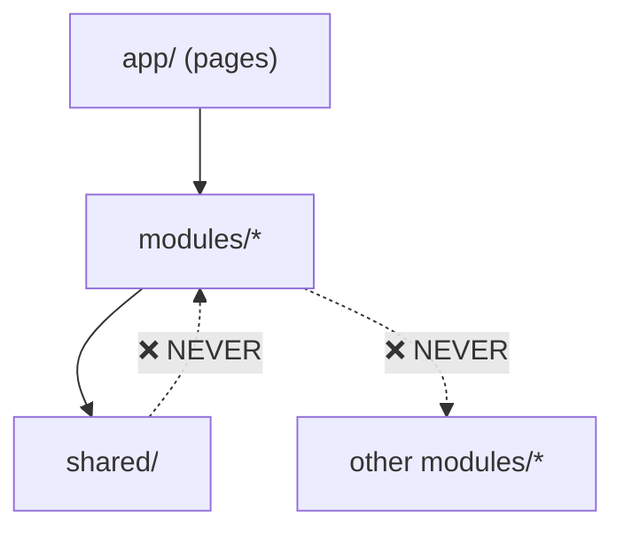

## Recommended Architecture: Feature-Sliced Design (FSD)

Adopt a **feature-sliced** (or "vertical slice") architecture where each business domain owns its own types, API layer, hooks, components, and state. This dramatically reduces the **blast radius** of any single change.

### Core Principles

| Principle | What It Means |
|---|---|
| **Domain Isolation** | Each feature (auth, files, jobs, quickbooks, zoho, dashboard) is self-contained |
| **Single Responsibility** | Each file does one thing; max ~200–300 lines |
| **Explicit Public API** | Each module exposes only what other modules need via `index.ts` barrel files |
| **Dependency Direction** | Features depend on `shared/` layer, never on each other directly |
| **Colocation** | Types, hooks, API calls, and components related to the same feature live together |

---

## Proposed Directory Structure

```
cleanflow_frontend/
├── app/                          # Next.js App Router (stays the same)
│   ├── layout.tsx
│   ├── page.tsx
│   ├── admin/
│   ├── auth/
│   ├── dashboard/
│   ├── files/
│   ├── jobs/
│   ├── quickbooks/
│   └── zoho-books/
│
├── modules/                      # ⭐ NEW: Feature modules (the heart of the restructure)
│   ├── auth/
│   │   ├── api/                  # Auth API calls (Cognito SDK)
│   │   │   └── cognito-client.ts
│   │   ├── components/           # Login, signup, MFA, email-verification, permission-wrapper
│   │   │   ├── login-form.tsx
│   │   │   ├── signup-form.tsx
│   │   │   ├── mfa-setup-dialog.tsx
│   │   │   ├── email-verification.tsx
│   │   │   ├── invite-set-password-form.tsx
│   │   │   ├── auth-guard.tsx
│   │   │   └── permission-wrapper.tsx
│   │   ├── hooks/
│   │   │   └── use-auth.ts       # Extracted from current 726-line useAuth.ts
│   │   ├── providers/
│   │   │   └── auth-provider.tsx
│   │   ├── types/
│   │   │   └── auth.types.ts     # User, AuthState, MfaSetupData, AuthContextType
│   │   └── index.ts              # Public API: export { useAuth, AuthProvider, AuthGuard }
│   │
│   ├── files/
│   │   ├── api/
│   │   │   ├── file-upload.api.ts      # Upload init, S3 presigned URL
│   │   │   ├── file-status.api.ts      # Status polling, status updates
│   │   │   ├── file-export.api.ts      # Download, export (CSV/Excel/JSON)
│   │   │   ├── file-profiling.api.ts   # Column profiling, DQ matrix
│   │   │   ├── file-settings.api.ts    # Presets, settings CRUD
│   │   │   └── http-client.ts          # Shared makeRequest() for this module
│   │   ├── components/
│   │   │   ├── file-details/           # ⭐ Split 1,276-line file-details-dialog.tsx
│   │   │   │   ├── file-details-dialog.tsx    # Shell/container (~150 lines)
│   │   │   │   ├── file-overview-tab.tsx      # Overview/status info
│   │   │   │   ├── file-dq-report-tab.tsx     # DQ report display
│   │   │   │   ├── file-issues-tab.tsx        # Outstanding issues list
│   │   │   │   ├── file-preview-tab.tsx       # Data preview table
│   │   │   │   ├── dq-matrix-dialog.tsx       # Matrix download dialog
│   │   │   │   └── row-wise-issues.tsx        # Row-wise issue grouping
│   │   │   ├── file-preloader.tsx
│   │   │   ├── column-profiling-panel.tsx
│   │   │   ├── column-export-dialog.tsx
│   │   │   ├── download-format-modal.tsx
│   │   │   └── push-to-erp-modal.tsx
│   │   ├── hooks/
│   │   │   ├── use-file-manager.ts     # Core file CRUD operations
│   │   │   ├── use-file-upload.ts      # Upload-specific logic (split from 829-line hook)
│   │   │   └── use-file-polling.ts     # Status polling logic
│   │   ├── types/
│   │   │   ├── file.types.ts           # FileItem, FileStats, FileStatusResponse
│   │   │   ├── dq-report.types.ts      # DqReportResponse, HybridSummary, OutstandingIssue
│   │   │   ├── profiling.types.ts      # ColumnProfile, ProfilingResponse, CrossFieldRule
│   │   │   └── export.types.ts         # ExportResponse, DownloadUrlsResponse
│   │   └── index.ts                    # Public API
│   │
│   ├── processing/
│   │   ├── components/
│   │   │   ├── processing-wizard.tsx
│   │   │   ├── wizard-dialog.tsx
│   │   │   ├── steps/
│   │   │   │   ├── column-selection-step.tsx
│   │   │   │   ├── settings-step.tsx
│   │   │   │   ├── profiling-step.tsx
│   │   │   │   ├── process-step.tsx
│   │   │   │   └── rules-step.tsx
│   │   │   └── color-coded-cell.tsx
│   │   ├── context/
│   │   │   └── wizard-context.tsx
│   │   ├── types/
│   │   │   └── processing.types.ts
│   │   └── index.ts
│   │
│   ├── dashboard/
│   │   ├── api/
│   │   │   └── dashboard.api.ts        # Overall DQ report fetching
│   │   ├── components/
│   │   │   ├── charts/                 # ⭐ Split 1,224-line dq-charts.tsx
│   │   │   │   ├── dq-score-chart.tsx
│   │   │   │   ├── row-distribution-chart.tsx
│   │   │   │   ├── processing-volume-chart.tsx
│   │   │   │   ├── charts-carousel.tsx
│   │   │   │   └── monthly-trends.tsx
│   │   │   ├── dashboard-header.tsx
│   │   │   ├── metrics-grid.tsx
│   │   │   ├── activity-feed.tsx
│   │   │   ├── analytics-section.tsx
│   │   │   └── system-health-card.tsx
│   │   ├── hooks/
│   │   │   └── use-dashboard-data.ts
│   │   ├── types/
│   │   │   └── dashboard.types.ts      # OverallDqReportResponse, MonthlyDqStats
│   │   ├── store/
│   │   │   └── dashboard.slice.ts
│   │   └── index.ts
│   │
│   ├── jobs/
│   │   ├── api/
│   │   │   └── jobs.api.ts             # Already well-structured (219 lines) ✅
│   │   ├── components/
│   │   ├── hooks/
│   │   ├── types/
│   │   │   └── jobs.types.ts
│   │   ├── store/
│   │   │   └── jobs.slice.ts           # (if needed)
│   │   └── index.ts
│   │
│   ├── quickbooks/
│   │   ├── api/
│   │   │   └── quickbooks.api.ts
│   │   ├── components/
│   │   │   ├── quickbooks-import.tsx
│   │   │   └── push-to-quickbooks-modal.tsx
│   │   ├── types/
│   │   │   └── quickbooks.types.ts
│   │   └── index.ts
│   │
│   ├── zoho/
│   │   ├── api/
│   │   │   └── zoho-books.api.ts
│   │   ├── components/
│   │   │   └── zoho-books-import.tsx
│   │   ├── types/
│   │   │   └── zoho.types.ts
│   │   └── index.ts
│   │
│   ├── unified-bridge/
│   │   ├── components/
│   │   │   ├── unified-bridge-import.tsx
│   │   │   ├── binary-upload-form.tsx
│   │   │   ├── ftp-source-form.tsx
│   │   │   ├── http-source-form.tsx
│   │   │   ├── tcp-source-form.tsx
│   │   │   └── erp-source-form.tsx
│   │   ├── types/
│   │   │   └── bridge.types.ts
│   │   └── index.ts
│   │
│   ├── transform/
│   │   ├── api/
│   │   │   └── erp-transform.api.ts
│   │   ├── components/
│   │   ├── store/
│   │   │   └── transform.slice.ts
│   │   └── index.ts
│   │
│   └── chat/
│       ├── components/
│       │   ├── chat-button.tsx
│       │   └── chat-drawer.tsx
│       ├── types/
│       │   └── chat.types.ts
│       └── index.ts
│
├── shared/                       # ⭐ NEW: Cross-cutting concerns only
│   ├── ui/                       # shadcn/ui primitives (unchanged, 54 files)
│   ├── config/
│   │   └── aws-config.ts
│   ├── hooks/
│   │   ├── use-mobile.ts
│   │   └── use-toast.ts
│   ├── lib/
│   │   ├── utils.ts              # cn(), etc.
│   │   ├── http-client.ts        # ⭐ NEW: Base HTTP client (replaces duplicated makeRequest)
│   │   ├── dq-rules.ts
│   │   ├── rule-metadata.ts
│   │   └── type-catalog.ts
│   ├── providers/
│   │   └── redux-provider.tsx
│   ├── store/
│   │   └── store.ts              # Root store (imports slices from modules)
│   ├── layout/
│   │   ├── app-sidebar.tsx
│   │   └── main-layout.tsx
│   └── types/
│       └── common.types.ts       # Shared types used across 2+ modules
│
├── styles/
│   └── globals.css
└── public/
```

---

## Key Architectural Decisions

### 1. Splitting Monolithic Files

These are the highest-priority splits to eliminate merge conflicts:

| Current File | Lines | Split Into | Rationale |
|---|---|---|---|
| [file-management-api.ts](file:///h:/Code/NeuroStack/CleanFlow/cleanflow_frontend/lib/api/file-management-api.ts) | 1,508 | `file-upload.api.ts`, `file-status.api.ts`, `file-export.api.ts`, `file-profiling.api.ts`, `file-settings.api.ts`, + separate type files | Types + upload + status + export + profiling are 5 independent concerns |
| [file-details-dialog.tsx](file:///h:/Code/NeuroStack/CleanFlow/cleanflow_frontend/components/files/file-details-dialog.tsx) | 1,276 | `file-details-dialog.tsx` (shell), `file-overview-tab.tsx`, `file-dq-report-tab.tsx`, `file-issues-tab.tsx`, `dq-matrix-dialog.tsx`, `row-wise-issues.tsx` | Each tab is independently editable |
| [dq-charts.tsx](file:///h:/Code/NeuroStack/CleanFlow/cleanflow_frontend/components/dashboard/dq-charts.tsx) | 1,224 | `dq-score-chart.tsx`, `row-distribution-chart.tsx`, `processing-volume-chart.tsx`, `charts-carousel.tsx`, `monthly-trends.tsx` | 4 independent chart components + carousel |
| [useFileManager.ts](file:///h:/Code/NeuroStack/CleanFlow/cleanflow_frontend/hooks/useFileManager.ts) | 829 | `use-file-manager.ts`, `use-file-upload.ts`, `use-file-polling.ts` | Upload, polling, and CRUD are separate concerns |
| [useAuth.ts](file:///h:/Code/NeuroStack/CleanFlow/cleanflow_frontend/hooks/useAuth.ts) | 726 | `cognito-client.ts` (SDK calls), `use-auth.ts` (state/hook), `auth.types.ts` | Separates Cognito SDK calls from React state management |

### 2. Dependency Rules (Import Boundaries)



| Rule | Description |
|---|---|
| **Pages → Modules** | App Router pages import from `modules/*/index.ts` only |
| **Modules → Shared** | Feature modules import from `shared/` for UI primitives, utils, config |
| **Modules ↛ Modules** | Features **never** import from each other directly |
| **Cross-module communication** | Use Redux store, URL params, or React context at the `app/` level |

> [!TIP]
> **ESLint enforcement**: Use `eslint-plugin-import` with `no-restricted-imports` rules to automatically catch cross-module imports in CI.
> ```js
> // .eslintrc.js
> rules: {
>   'no-restricted-imports': ['error', {
>     patterns: [
>       { group: ['@/modules/files/*'], message: 'Import from @/modules/files (barrel) instead' },
>       { group: ['@/modules/auth/*'], message: 'Import from @/modules/auth (barrel) instead' },
>     ]
>   }]
> }
> ```

### 3. Shared HTTP Client

Currently, every API module duplicates a `makeRequest()` method. Extract a single shared client:

```typescript
// shared/lib/http-client.ts
export class HttpClient {
  constructor(private baseURL: string) {}
  
  async request<T>(endpoint: string, authToken: string, options?: RequestInit): Promise<T> {
    const response = await fetch(`${this.baseURL}${endpoint}`, {
      ...options,
      headers: {
        'Content-Type': 'application/json',
        'Authorization': authToken,
        ...options?.headers,
      },
    })
    if (!response.ok) throw new ApiError(response)
    return response.json()
  }
  
  get<T>(endpoint: string, token: string) { return this.request<T>(endpoint, token) }
  post<T>(endpoint: string, token: string, body: unknown) { ... }
  put<T>(endpoint: string, token: string, body: unknown) { ... }
  delete<T>(endpoint: string, token: string) { ... }
}
```

### 4. Barrel Exports for Clear Public APIs

Every module's `index.ts` explicitly defines what is importable:

```typescript
// modules/files/index.ts
export { useFileManager } from './hooks/use-file-manager'
export { useFileUpload } from './hooks/use-file-upload'
export { FileDetailsDialog } from './components/file-details/file-details-dialog'
export { ColumnProfilingPanel } from './components/column-profiling-panel'
export type { FileItem, FileStats, FileStatusResponse } from './types/file.types'
export type { DqReportResponse } from './types/dq-report.types'
```

This means the **only** way other code can import from the `files` module is:
```typescript
import { FileDetailsDialog, type FileItem } from '@/modules/files'
```

### 5. Type Extraction Pattern

Move all types to dedicated `types/` directories within each module. This means:
- **API file stays small** — only functions, no interface definitions
- **Types are independently editable** — adding a field to `FileStatusResponse` doesn't cause merge conflicts with someone fixing an API call
- **Types are shareable** — via barrel re-exports without importing API logic

---

## Migration Strategy

> [!CAUTION]
> Do NOT attempt a big-bang migration. Use the incremental approach below.

### Phase 1: Extract Types (Low Risk, High Impact)
1. Create `modules/<feature>/types/` directories
2. Move all `interface` and `type` definitions out of API and component files
3. Update imports (search-and-replace)
4. **Merge conflicts reduced by ~30%** — types are the most commonly edited

### Phase 2: Split Monolithic Files (Medium Risk, Highest Impact)
1. Start with `file-management-api.ts` → 5 focused API files
2. Split `file-details-dialog.tsx` → 6 tab/section components
3. Split `dq-charts.tsx` → 5 chart components
4. Split `useFileManager.ts` → 3 focused hooks
5. **Merge conflicts reduced by ~50%** — the biggest files cause the most conflicts

### Phase 3: Reorganize into Modules (Medium Risk)
1. Create the `modules/` directory structure
2. Move files feature-by-feature (start with `jobs/` — it's already well-isolated)
3. Add barrel `index.ts` files
4. Update `tsconfig.json` path aliases:
   ```json
   {
     "paths": {
       "@/modules/*": ["./modules/*"],
       "@/shared/*": ["./shared/*"],
       "@/*": ["./*"]
     }
   }
   ```

### Phase 4: Enforce Boundaries (Low Risk)
1. Add ESLint `no-restricted-imports` rules
2. Add shared `HttpClient`
3. Document module ownership in `CODEOWNERS`

---

## CODEOWNERS for Team Assignment

```
# .github/CODEOWNERS — assign module ownership
/modules/auth/         @auth-team
/modules/files/        @files-team
/modules/processing/   @processing-team
/modules/dashboard/    @analytics-team
/modules/jobs/         @integrations-team
/modules/quickbooks/   @integrations-team
/modules/zoho/         @integrations-team
/modules/unified-bridge/ @integrations-team
/modules/transform/    @transform-team
/modules/chat/         @ai-team
/shared/               @platform-team
```

---

## Impact Summary

| Metric | Before (Current) | After (Restructured) |
|---|---|---|
| Max file size | 1,508 lines | ~200–300 lines |
| Cross-feature dependencies | 8+ files import `file-management-api` | 0 direct cross-module imports |
| Files changed per feature | 4–8 across multiple dirs | **1–3 within one module** |
| Merge conflict surface | Entire `lib/`, `components/`, `hooks/` | **Isolated to module directory** |
| Onboarding time (new dev) | Must understand full project | **Only learn assigned module** |
| AI agent blast radius | Can touch any file | **Constrained to module boundaries** |

---

## File Size Guidelines

| Category | Recommended Max | Current Worst |
|---|---|---|
| API service file | 200 lines | 1,508 lines |
| Component file | 300 lines | 1,276 lines |
| Hook file | 200 lines | 829 lines |
| Type definition file | 150 lines | Mixed in with API files |
| Redux slice | 150 lines | OK (currently reasonable) |

> [!NOTE]
> **Rule of thumb**: If a file exceeds 300 lines, it likely has multiple responsibilities and should be split. If it exceeds 500 lines, it **must** be split.
